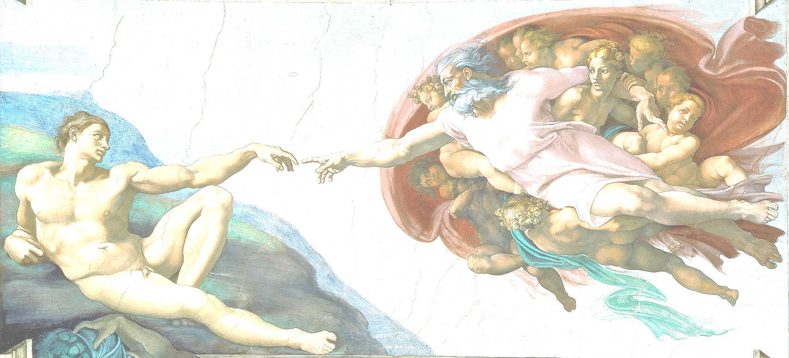
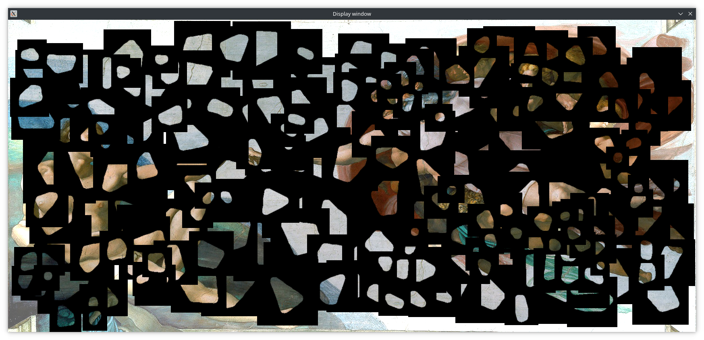
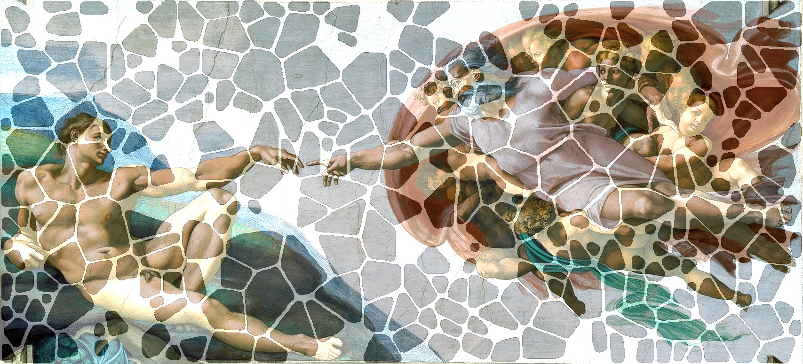

# Report
Potier - Boireau
## Loading original image and display it in background
- Load the image
- Create another image with white color and not full alpha

## Loading fragments
- 
## Adding fragments to image

## Channels of original image and fragments' do not match
- adding alpha channel to original image

## Not copying transparent borders of fragments
- building a mask to filter the pixel with low alpha component and passing it to copyTo()

