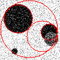

# Report
Potier - Boireau

## Exercise 1 - Hough transform for circles
1. Let $r \in [1, 100]$
- If $\delta r = 2$, we have 50 discrete values
- If $\delta r = 0.5$, we have 200 discrete values

2. Let $r, c \in [1, 100]$, $rad \in [5, 100\sqrt2]$ and $\delta r$ = $\delta c$ = $\delta rad$ = 1
- For r and c we have 100 discrete values each
- For rad we have $\frac{rad_{max} - rad_{min}}{\delta_{rad}}$ = $\frac{100\sqrt2 - 5}{1}$ = 137 discrete values
> So we can describe $100 \times 100 \times 137$ = $1 370 000$ circles

3.
In the general case we have $acc(r, c, rad)$ corresponding to the circle with:
- center = $(r_{min} + (i-1) \times \delta r, c_{min} + (j-1) \times \delta c)$
- rad = $rad_{min} + (k-1) \times \delta rad$

If we take the intervals and steps from the last question:
- $acc(1, 1, 1)$ corresponds to the circle with:
    - center = $(1, 1)$
    - rad = $5$
- $acc(10, 7, 30)$ corresponds to the circle with:
    - center = $(1 + (10-1), 1 + (7-1))$ = $(10, 7)$
    - rad = $5 + (30-1)$ = $34$

4.
$x = r_{min} + (i - 1) \times \delta r$

$(i - 1) \times \delta r =  x - r_{min}$

$i = \lfloor \frac{x - r_{min}}{\delta r} + 1 \rfloor$

and :

$j = \lfloor \frac{y - c_{min}}{\delta c} + 1 \rfloor$

$k = \lfloor \frac{k - rad_{min}}{\delta rad} + 1 \rfloor$

With the previous intervals and steps:
- $i = \frac{40 - 1}{1} + 1 = 40$
- $j = \frac{40 - 1}{1} + 1 = 40$
- $k =  \frac{13 - 5}{1} + 1 = 9$

___

## Exercise 2: Detector implementation

First, we load an image an apply a Gaussian filter on it, this will help us in the future to reduce the noise.

|  |  |
| :------------------------------------: | :----------------------------------------------: |
| Original image                         |           Image after Gaussian filter            |

The next step is to compute the magnitude of the gradient using a Sobel filter.
```cpp
cv::Mat gradient_x, gradient_y;
cv::Sobel(original_img, gradient_x, -1, 1, 0);
cv::Sobel(original_img, gradient_y, -1, 0, 1);

cv::Mat abs_gradient_x, abs_gradient_y;
cv::convertScaleAbs(gradient_x, abs_gradient_x);
cv::convertScaleAbs(gradient_y, abs_gradient_y);

cv::Mat gradient;
cv::addWeighted(abs_gradient_x, 0.5, abs_gradient_y, 0.5, 0, gradient);
```

At the beginning we use the depth of the input image (8 bits) for the depth of the output gradient matrix. This would cause overflows in some cases.

Take a zone of the image such as:
|   |   |   |
|:-:|:-:|:-:|
|255|255|255|
| _ | X | _ |
| 0 | 0 | 0 |
|   |   |   |

and the vertical sobel filter:
|   |   |   |
|:-:|:-:|:-:|
|-1 |-2 |-1 |
| 0 | 0 | 0 |
| 1 | 2 | 1 |
|   |   |   |

Applying the filter would result in $ X = -4 \times 255$ which is not possible to encode on 8 bits.
Because of this, some parts of the circles are not detected.


To avoid this, we have to tell `cv::Sobel()` to compute the value of the gradient into a 16 bits value:
```cpp
cv::Sobel(original_img, gradient_x, CV_16S, 1, 0);
cv::Sobel(original_img, gradient_y, CV_16S, 0, 1);
```
Now, circle are entirely detected:


Now that we have the gradient, we select pixel that we consider as edges using a certain threshold
```cpp
double threshold_coef = 0.5;
double gradient_max;
cv::minMaxLoc(gradient, nullptr, &gradient_max);
double threshold_gradient = gradient_max * threshold_coef;
gradient.forEach<uint8_t>([threshold_gradient](uint8_t& pixel, const int* pos) {
    pixel = pixel < threshold_gradient ? 0 : 255;
});
```
We started by selcting only pixels that were above 80% of the max value in the gradient matrix but some of the circles edges were filtered out. We lowered the threshold to 50% and it worked as we wanted.

|     |   |
| :------------------------------------: | :----------------------------------: |
|                 80%                    |                   50%                |

We are now sure that the edges are correctly detected and we can start to fill our accumulator.
The size of the accumulator is $nb\_row \times nb\_col \times nb\_radius$.
```cpp
std::vector<int> accumulator(gradient.cols * gradient.rows * nb_radius, 0);
```

For each edge point, we iterate over all pixels of the image and compute the radius of the circle that includes the edge point.
```cpp
for (size_t i = 0; i < gradient.rows; i++)
{
    for (size_t j = 0; j < gradient.cols; j++)
    {
        if (gradient.at<uint8_t>(i, j) < threshold_gradient)
            continue;

        for (size_t r = 0; r < gradient.rows; r++)
        {
            for (size_t c = 0; c < gradient.cols; c++)
            {
                int delta_x = i - r;
                int delta_y = j - c;
                int radius = std::sqrt(std::pow(delta_x, 2) + std::pow(delta_y, 2));
                if (radius >= radius_min && radius < radius_max)
                    accumulator[compute_accumulator_index(r, c, radius)]++;
            }
        }
    }
}
```
Once the accumulator is filled, we search for local maximums to identify circle candidates
```cpp
std::vector<accumulator_point> local_maximums;
for (int r = 0; r < gradient.rows; r++)
{
   for (int c = 0; c < gradient.cols; c++)
   {
       for (int rad = radius_min; rad < radius_max; rad++)
       {
           if (is_local_max(accumulator, r, c, rad))
               local_maximums.emplace_back(r, c, rad, accumulator[compute_accumulator_index(r, c, rad)]);
       }
   }
}

bool is_local_max(std::vector<int> const& accumulator, int r, int c, int rad)
{
    int local_value = accumulator[compute_accumulator_index(r, c, rad)];
    bool is_max = local_value > 0;
    for (int i = -1; i <= 1 && is_max; i++)
    {
        if (r + i < 0 || r + i >= nb_row)
            continue;
        for (int j = -1; j <= 1 && is_max; j++)
        {
            if ( c + j < 0 || c + j >= nb_col)
                continue;
            for (int k = -1; k <= 1 && is_max; k++)
            {
                if ((i == 0 && j == 0 && k == 0) || rad + k < radius_min || rad + k >= radius_max)
                    continue;
                is_max = local_value > accumulator[compute_accumulator_index(r + i, c + j, rad + k)];
            }
        }
    }

    return is_max;
}
```
Then we sort the circles by their scores in the accumulator
```cpp
std::sort(local_maximums.begin(), local_maximums.end(), [](accumulator_point const& lhs, accumulator_point const& rhs) {
    return lhs.score > rhs.score;
});
```
And we draw the 5 bests
```cpp
for (int i = 0; i < 5; i++)
    draw_circle(original_img, local_maximums[i]);
...

void draw_circle(cv::Mat const& image, accumulator_point const& accu_point)
{
    cv::circle(image,
        cv::Point(accu_point.c, accu_point.r),
        accu_point.radius,
        cv::viz::Color::red());
}
```
When incrementing the accumulator regardless of the circle's radius, we got this result:


To improve the results, we vote by normalizing the gradient magnitude by the circle's radius
```cpp
double radius = std::sqrt(std::pow(delta_x, 2) + std::pow(delta_y, 2));
if (radius >= radius_min && radius < radius_max)
    accumulator[compute_accumulator_index(r, c, radius)] += gradient.at<uint8_t>(i, j) / radius;
```
And the result are much better, even with noise:

||||
|:-----------------------------: | :------------------------------: |:---------------------------:|
|   Vote by gradient magnitude   |Vote normalized by circle's radius|         Both combined       |

## Exercise 3: Compute time

1. To benchmark our implementation of the algorithm, we use this code:
```cpp
auto start = std::chrono::system_clock::now();
naive_circle_detection(original_image);
auto end = std::chrono::system_clock::now();
std::cout << "Compute time: " << std::chrono::duration_cast<std::chrono::milliseconds>(end - start).count() << " ms\n";
```
Compute time for `four.png` is aroung 43 milliseconds on my laptop:
```bash
for ((i=0; i<5; i++)); do
    Release/circle-detector 2>/dev/null | grep Compute;
done
Compute time: 43 ms
Compute time: 44 ms
Compute time: 43 ms
Compute time: 43 ms
Compute time: 43 ms
```
The complexity of the algorithm is $N^{4}$ with $N$ being the image size because we first loop over each pixel to find the edge points ($N^{2}$) and then, for each edge point, we re-loop over the whole image to vote ($N^{2}$ again).

$N=100$

$100^{4}\times t = 43$

$t = \frac{43}{100^{4}}$

$t = 4.3\times 10^{-7}$

For a 600 pixel wide image the result should be:

$600^{4}\times t = ?$

$600^{4}\times  4.3\times 10^{-7}= 55728$ ms or $55.73$ s

But in real life:
```bash
Compute time: 39867 ms
```
The difference is quite high because the algorithm is not only composed of the $N^{4}$ part (vote) but also of a $N^{3}$ part (the local maximum search). This $N^{3}$ part is negligible when $N$ is big as in the case of the 600x600 image, but can have a significant impact when $N$ is small.

So when we measure the 100x100 image we should only take into account the vote part.
```bash
Vote compute time: 31 ms
```
So the new estimation is:

$600^{4}\times  3.1\times 10^{-7}= 40176$ ms or $40.18$ s

And the actual result for the 600x600 image is:
```bash
Vote compute time: 34371 ms
```
